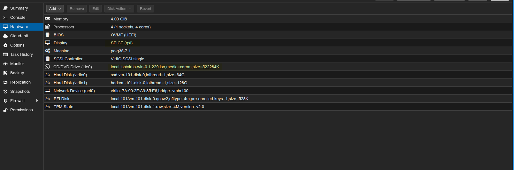

# Proxmox SPICE CLI

Um programa compacto escrito em Golang que permite a conexão com uma máquina virtual (VM) em um servidor Proxmox usando SPICE a partir da linha de comando (CLI) em plataformas Linux, Windows e Mac.

Inspirado em https://github.com/Elbandi/proxmox-spice-quickconnect

O Proxmox SPICE CLI permite que os usuários iniciem, parem e conectem-se facilmente a uma VM em um host Proxmox usando a interface de linha de comando. O projeto é escrito em Golang.

# Configuração

Um exemplo de arquivo de configuração pode ser encontrado dentro do arquivo de release ou no repositório do Git.

Usando a flag --config, você pode usar uma configuração colocada em qualquer pasta.

Configure o programa colocando o arquivo de configuração nos seguintes locais:

## Linux

`~/.proxmox-spice-cli`

## Windows

`C:\Users\$env:USERNAME\.proxmox-spice-cli`

Para Windows, modifique o caminho SPICE de:
```json
    "path": "/usr/bin/remote-viewer"
```
para o caminho do remote-viewer.exe, certificando-se de escapar as barras como este: `\\`

# Spice
Ative o SPICE na configuração da VM no Proxmox

No Windows, não se esqueça de instalar o complemento de convidado SPICE 
